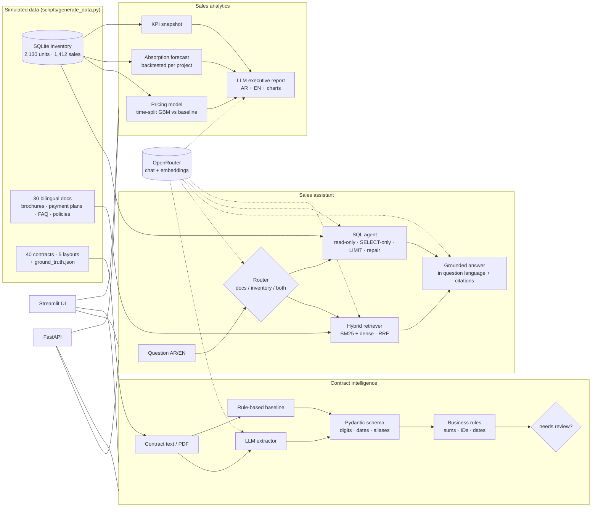

# AqarIntel 🏗️ — AI for Real Estate Development (Arabic-first)

**منصة ذكاء اصطناعي للمطورين العقاريين: مساعد مبيعات ثنائي اللغة، استخراج بيانات العقود، وتحليلات المبيعات.**

An end-to-end demo of how a Saudi real-estate developer can put LLMs and ML to work on three
concrete jobs, built on **simulated data** (fictional developer, projects, buyers and contracts):

| Module | What it does | Key techniques |
|---|---|---|
| 💬 **Sales assistant** | Answers buyer/sales-team questions in Arabic or English from project brochures, payment plans and policies **and** the live unit inventory | Hybrid RAG (BM25 + embeddings, RRF), Arabic text normalisation, guarded text-to-SQL, citations |
| 📄 **Contract intelligence** | Turns Arabic/English sale contracts into structured, validated records and flags inconsistencies for review | LLM extraction → Pydantic schema, business-rule validation, ground-truth evaluation, rule-based baseline |
| 📈 **Sales analytics** | Prices units, forecasts absorption per project, and writes a bilingual executive report | Gradient boosting with time-based split, backtested forecasters, LLM report over computed KPIs |

All LLM calls go through **OpenRouter** (one key, any model). Without a key the whole platform still runs
offline in mock mode — retrieval, SQL guardrails, validation, analytics and 30 unit tests included.

---

## Architecture



---

## Quickstart

```bash
git clone https://github.com/Ahmed-5/aqar-intel.git && cd aqar-intel
python -m venv .venv && source .venv/bin/activate      # Windows: .venv\Scripts\activate
pip install -r requirements.txt

cp .env.example .env                                    # add your OPENROUTER_API_KEY
python scripts/build_index.py                           # embed the document corpus (≈ 160 chunks)

streamlit run app/streamlit_app.py                      # UI  → http://localhost:8501
uvicorn api.main:app --reload                           # API → http://localhost:8000/docs
```

Command-line demo:

```bash
python scripts/run_demo.py ask "كم عدد الفلل المتاحة في واحة النرجس وما أقل سعر؟"
python scripts/run_demo.py ask "What is the cancellation policy after signing?"
python scripts/run_demo.py extract data/contracts/contract_002_B.txt
python scripts/run_demo.py evaluate --extractor both     # LLM vs rule-based baseline on 40 contracts
python scripts/run_demo.py report                        # train, forecast, write AR/EN executive report
```

Docker: `docker build -t aqar-intel . && docker run -p 8501:8501 --env-file .env aqar-intel`

> **No API key?** Everything still runs: `AQAR_LLM_MODE=mock python scripts/run_demo.py all`.
> Retrieval falls back to BM25 + hashing embeddings and LLM answers are replaced by labelled placeholders.

---

## What each module actually does

### 1. Sales assistant (`aqar_intel/rag/`)

* **Chunking** is heading-aware; every chunk carries `project_id`, `lang`, `doc_type` metadata from the document
  front-matter and is prefixed with the document title so "Discounts" still knows which project it belongs to.
* **Retrieval is hybrid.** Arabic questions hinge on exact domain tokens (project names, *سكني*, *وافي*, unit
  numbers) where BM25 is precise; embeddings handle paraphrase and cross-lingual queries. Scores are combined with
  reciprocal-rank fusion, then softly boosted toward the question's language and detected project.
* **Arabic normalisation** (`aqar_intel/arabic.py`): diacritics, tatweel, alef/taa-marbuta/yaa variants,
  Arabic-Indic digits and the definite article are normalised before BM25, so *السعر* matches *سعر*.
* **Text-to-SQL has real guardrails**, not just a prompt: read-only SQLite connection, single `SELECT`/`WITH`
  statement only, forbidden-keyword scan, enforced `LIMIT`, statement timeout, and one automatic repair round-trip
  when the query errors. The LLM never sees credentials.
* **Routing** (docs / inventory / both) is done by the LLM with a keyword heuristic as fallback, so the assistant
  degrades gracefully rather than failing on odd model output.

### 2. Contract intelligence (`aqar_intel/contracts/`)

* **Schema as the contract.** `ContractRecord` (Pydantic) normalises what models return: `١,١٥١,٠٠٠` → `1151000`,
  `١٤ مارس ٢٠٢٦` / `14/03/2026م` / `3 October 2025` → ISO dates, *شقة* → `apartment`, *تمويل بنكي* → `bank_financing`.
* **Validation, not trust.** Business rules check that down-payment + instalments = price, IDs are 10 digits,
  phones are Saudi mobiles, delivery follows signing, and required fields exist. Failing records are flagged
  `needs_review` instead of silently loaded downstream.
* **Measured, not eyeballed.** 40 contracts across 5 layouts (formal clauses, letter style with Arabic-Indic digits,
  CRM key/value sheet, English agreement, free-form confirmation letter) ship with ground truth, and three records
  are *deliberately* inconsistent. `evaluate` reports per-field and per-template accuracy plus how many planted
  issues the validator caught.
* **A baseline to beat.** The regex extractor is exact on the four layouts it knows and near-zero on the fifth,
  held-out layout — the concrete argument for an LLM extractor that generalises across templates.

### 3. Sales analytics (`aqar_intel/analytics/`)

* **Pricing model** — `HistGradientBoostingRegressor` on `log(price)` with categorical support; **time-based split**
  (last 6 months held out) so future price levels never leak into training; reported next to a
  price-per-sqm-by-project baseline; permutation importance on the test set.
* **Absorption forecasting** — three transparent forecasters (naive, 3-month mean, damped Holt trend) compared on a
  rolling-origin backtest per project; the winner is used, and *months of inventory* is derived from it.
* **Executive report** — the LLM receives only computed KPIs/metrics as JSON and writes a concise AR + EN summary
  with recommendations; charts are generated deterministically with matplotlib.

---

## Results on the simulated data

Offline, reproducible with `AQAR_LLM_MODE=mock python scripts/run_demo.py all` (seed 42):

**Pricing model** (train 1,177 / test 235 sales, test from 2026-03)

| Metric | Gradient boosting | Baseline (price/sqm by project & type) |
|---|---|---|
| MAE | SAR 98k | SAR 163k |
| MAPE | **4.3%** | 6.9% |
| R² | **0.981** | 0.948 |

Top permutation importances: `area_sqm`, `project_id`, `unit_type`, `bathrooms`, `view`.

**Contract extraction — rule-based baseline** (40 contracts, 17 fields)

| Template | A (clauses) | B (letter, Arabic-Indic digits) | C (CRM sheet) | D (English) | E (held-out) | Overall |
|---|---|---|---|---|---|---|
| Field accuracy | 100% | 100% | 100% | 100% | 2.9% | 80.4% |

Planted inconsistencies caught by validation: **3 / 3**.

**Contract extraction — LLM** (`python scripts/run_demo.py evaluate --extractor llm`)

> Fill in after running with your OpenRouter key; the script writes the table to `data/reports/extraction_eval.md`.
> Compare especially template **E**, where the baseline fails, and template **B** (Arabic-Indic digits).

---

## Repository layout

```
aqar_intel/
  config.py            settings from .env (OpenRouter key/models, mode)
  llm.py               OpenRouter client · MockLLM (offline) · FakeLLM (tests) · robust JSON parsing
  arabic.py            normalisation, tokenisation, language detection
  data_gen/            world.py (fictional projects) · inventory.py · documents.py · contracts.py
  rag/                 chunking · embeddings · retriever (hybrid) · sql_agent (guarded) · assistant
  contracts/           schema (Pydantic + rules) · extractor (LLM + baseline) · evaluate
  analytics/           pricing · absorption · report
app/streamlit_app.py   3-tab demo UI
api/main.py            FastAPI service
scripts/               generate_data.py · build_index.py · run_demo.py
tests/                 30 offline tests (pytest)
data/                  simulated data (committed) · index/models/reports (generated)
```

---

## Design notes & production path

* **Provider-agnostic.** OpenRouter today; because the code uses the OpenAI-compatible SDK, pointing at Azure
  OpenAI, Bedrock's compatible gateway or an on-prem vLLM server is a `base_url` change. Data-residency
  requirements (e.g. keeping documents inside KSA) can be met by swapping only `llm.py`/`embeddings.py`.
* **Vector store.** The index is a JSON + `.npy` pair for transparency; the `HybridRetriever` interface maps
  directly onto pgvector, Qdrant or Azure AI Search for corpora of thousands of documents.
* **Scanned contracts.** `load_contract_text` handles text-layer PDFs; scanned PDFs slot in an OCR step
  (Tesseract `ara`, Azure Document Intelligence, or a vision LLM) before the same extractor and validator.
* **Evaluation first.** Every module has a baseline and a held-out measurement: RAG retrieval tests, extraction
  ground truth, time-split pricing, backtested forecasts. A model that does not beat its baseline does not ship.
* **Tree models do not extrapolate trends.** The pricing model treats months beyond its training window as the
  last known month; for a live system, detrend prices with a price index or add a linear time term. This is
  visible in the near-zero importance of `month_index` and is left as-is deliberately for honesty.
* **Access control.** The SQL agent is read-only by construction. In production, row-level filters
  (e.g. a sales agent only sees their region) belong in the database view the agent connects to, not in the prompt.

---

## Disclaimer

All company names, projects, prices, buyers, IDs and contracts are fictional and generated by
`scripts/generate_data.py`. Policy text (RETT, Sakani, Wafi, warranty periods) is illustrative and should not be
relied on as regulatory guidance.

## Author

**Ahmed Alhassan** — AI/ML Engineer · [LinkedIn](https://linkedin.com/in/am5ai) · [GitHub](https://github.com/Ahmed-5) · ahmedelhassen11@gmail.com

MIT License.
